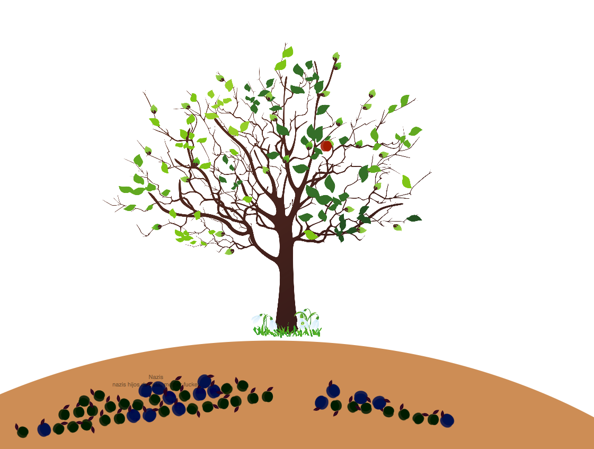

**Rotten** explores the potency of language and the damage of hate speeches. Words that could have been fruits of thought are rotten by the hate and fall from the tree of life. As the fruits hit the ground, some words burst out and then fade into thin air. Comments determined by Perspective API as severely toxic are displayed in purple and the rest in red.

Content warnings: The program contains coarse language identified by Perspective API.
