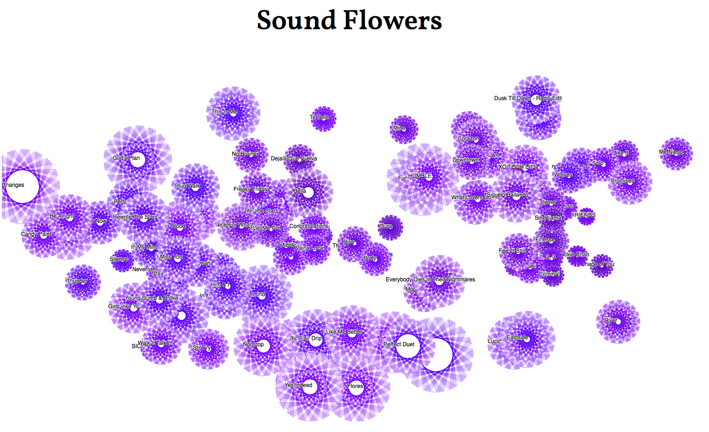

Sound flowers is generated by the audio attributes of top 2018 Spotify songs, positioned using t-SNE algorithm. 

The size of the flowers are proportional to the loudness of the songs,the layers of petals encode the energy levels, and color gradients are related to the measure of happiness (with a blue tint added to calmer and sadder songs).
